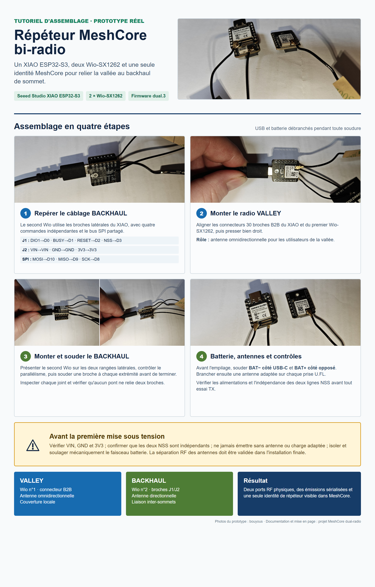

# Répéteur MeshCore bi-radio pour XIAO ESP32-S3

[Documentation anglaise](README.md)

Ce dépôt contient un firmware expérimental pour piloter deux cartes radio **Seeed Studio Wio-SX1262 for XIAO** depuis un seul **Seeed Studio XIAO ESP32-S3**.

Le but est de construire un relais de sommet avec une seule identité MeshCore :

- `VALLEY` utilise le Wio-SX1262 monté sur le connecteur 30 broches et une antenne omnidirectionnelle pour la vallée ;
- `BACKHAUL` utilise le second Wio-SX1262 soudé sur les broches latérales et une antenne directionnelle vers un autre sommet.

Le matériel apparaît donc comme **un seul répéteur** lors d’un scan MeshCore, même s’il possède deux ports radio physiques.


Cette image présente le principe de déploiement entre vallée et sommet. Ce n'est pas le plan de câblage broche par broche : utiliser la [notice de câblage vérifiée](docs/WIRING.md) avant tout assemblage.

## Câblage essentiel

Les deux Wio-SX1262 partagent le bus SPI du XIAO :

| Signal | Broche XIAO | GPIO |
| --- | --- | ---: |
| SCK | D8 | 7 |
| MISO | D9 | 8 |
| MOSI | D10 | 9 |
| Alimentation logique | 3V3 | - |
| Masse | GND | - |

Le second Wio-SX1262, `BACKHAUL`, utilise ses propres lignes de contrôle :

| Signal | Broche XIAO | GPIO |
| --- | --- | ---: |
| DIO1 | D0 | 1 |
| BUSY | D1 | 2 |
| RESET | D2 | 3 |
| NSS / CS | D3 | 4 |

Le tableau complet, le sens des cartes et les vérifications au multimètre sont dans la [notice de câblage](docs/WIRING.md).

## Tutoriel photo d'assemblage



Le [guide d'assemblage détaillé](docs/ASSEMBLY.fr.md) utilise les photographies du prototype réel pour montrer la batterie, le radio B2B, le second radio sur les broches latérales, les antennes et les contrôles avant alimentation. La [version anglaise](docs/ASSEMBLY.md) est également disponible.

## Batterie : à souder avant le second Wio

Les deux pastilles batterie sont sous le XIAO et deviendront difficiles d’accès une fois la carte `BACKHAUL` soudée. Il faut donc installer auparavant un petit faisceau isolé :

- `BAT-` : pastille la plus proche du connecteur USB-C, fil noir ;
- `BAT+` : pastille la plus éloignée du connecteur USB-C, fil rouge.

Utiliser uniquement une batterie lithium rechargeable qualifiée de **3,7 V**. Ne pas la brancher sur `VIN`, `5V` ou `3V3`. Débrancher l’USB et la batterie pendant toute soudure, vérifier la polarité au multimètre, puis isoler et maintenir mécaniquement les fils. L’encart vert du schéma montre la vue du dessous et l’orientation exacte.

## Fonctionnement du firmware

- Les deux radios écoutent lorsque le répéteur est au repos.
- Une seule radio émet à la fois.
- Tout paquet que MeshCore décide de relayer est envoyé successivement sur les deux ports activés ; le port opposé à la réception émet en premier.
- Les paquets créés localement sont eux aussi envoyés successivement sur les deux ports activés.
- Un cache de signatures et la table anti-doublons MeshCore empêchent les boucles ordinaires.
- La fréquence, la bande passante, le spreading factor et le coding rate restent communs aux deux radios.
- La puissance TX et l’activation peuvent être réglées séparément pour chaque port.


Le temps de garde par défaut est de **10 ms**, et non 40 ms. Il sert à laisser le SX1262 et le bus SPI changer proprement d’état ; il ne crée pas une réception duplex. Pendant la garde et pendant toute émission LoRa, les deux récepteurs sont en veille. Un message arrivant exactement à ce moment peut donc être manqué. Les nouvelles tentatives aléatoires de MeshCore réduisent ce risque sans pouvoir l’annuler. Le détail est expliqué dans [ARCHITECTURE.md](docs/ARCHITECTURE.md).

## Commandes CLI bi-radio

```text
get dualradio
get valley
get backhaul
stats valley
stats backhaul
set valley tx 14
set backhaul tx 22
set valley enabled on
set backhaul enabled on
set dualradio guard 10
clear dualradio.stats
reset dualradio
dualradio help
```

La commande MeshCore habituelle `set tx <dBm>` règle les deux radios ensemble. Les réglages bi-radio sont conservés dans la mémoire NVS. La [référence CLI](docs/CLI.md) précise chaque commande.

## Flasher le XIAO

Fermer le configurateur MeshCore et tout moniteur série avant de flasher, car un seul logiciel peut utiliser le port COM.

Avec PlatformIO :

```powershell
pio run -e Xiao_S3_WIO_dual_repeater -t upload --upload-port COM26
```

Avec l’image complète fournie :

```powershell
esptool.py --chip esp32s3 --port COM26 write_flash 0x0 firmware/MeshCore_Xiao_S3_WIO_dual_repeater_v1.16.0-dual.4-merged.bin
```

Remplacer `COM26` si Windows attribue un autre port. Ne jamais écrire l’image d’application seule à l’adresse `0x0` ; elle doit être écrite à `0x10000`. La procédure complète et le mode récupération sont dans [FLASHING.md](docs/FLASHING.md).

Après un flash complet, ouvrir [config.meshcore.io](https://config.meshcore.io/), vérifier l’identité et le profil radio, puis remplacer immédiatement le mot de passe d’administration par défaut (`password`) avant le déploiement.

## État des essais

Le prototype a été compilé, flashé et testé sur `COM26` le 10 juillet 2026 :

- initialisation correcte des deux SX1262 ;
- six paquets reçus sur six dans chaque sens pendant l’essai radio brut ;
- une annonce MeshCore logique envoyée successivement sur `VALLEY`, puis `BACKHAUL` ;
- commandes de puissance, activation, garde et statistiques validées ;
- réglages persistants après redémarrage ;
- identité MeshCore d’origine conservée lors de la mise à jour applicative.

La version installée est `v1.16.0-dual.4`. La configuration finale relevée est : deux ports activés, `22 dBm` sur chacun, garde `10 ms`, fréquence `869.6179809 MHz`, bande passante `62.5 kHz`, SF `8`, CR `8`. Des essais MeshCore réels ont confirmé trois relais logiques et trois émissions physiques sur chacun des deux ports, sans erreur radio.

Certains clients MeshCore comptent les réceptions ou accusés physiques plutôt que les identités uniques. Le compteur « entendu par » peut donc augmenter plusieurs fois pour le dual-radio, alors que la liste affiche correctement une seule identité de répéteur.

Les essais longue durée, l’isolation RF réelle entre antennes et la liaison montagne à montagne restent à effectuer. Voir le [rapport de test](docs/TEST_REPORT.md).

## Origine du projet

Ce travail personnel est basé sur MeshCore `repeater-v1.16.0`, commit `07a3ca9`. Il a été réalisé par l’utilisateur GitHub `bouyous` avec l’assistance de ChatGPT/Codex pour l’analyse, le code, la compilation, le flash et la documentation. L’assemblage et les essais matériels ont été effectués par le propriétaire du projet.

Ce projet n’est pas une version officielle de MeshCore et n’est pas présenté comme prêt pour une installation de production.
