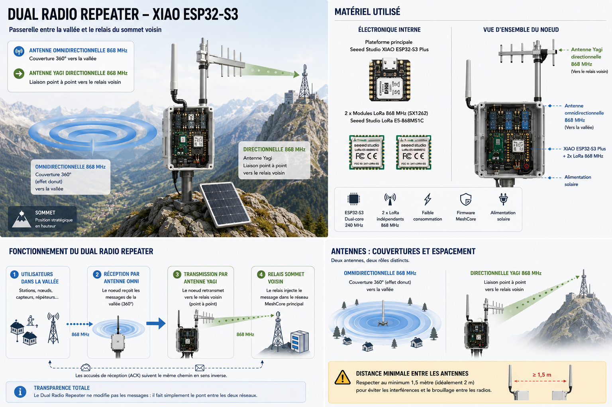
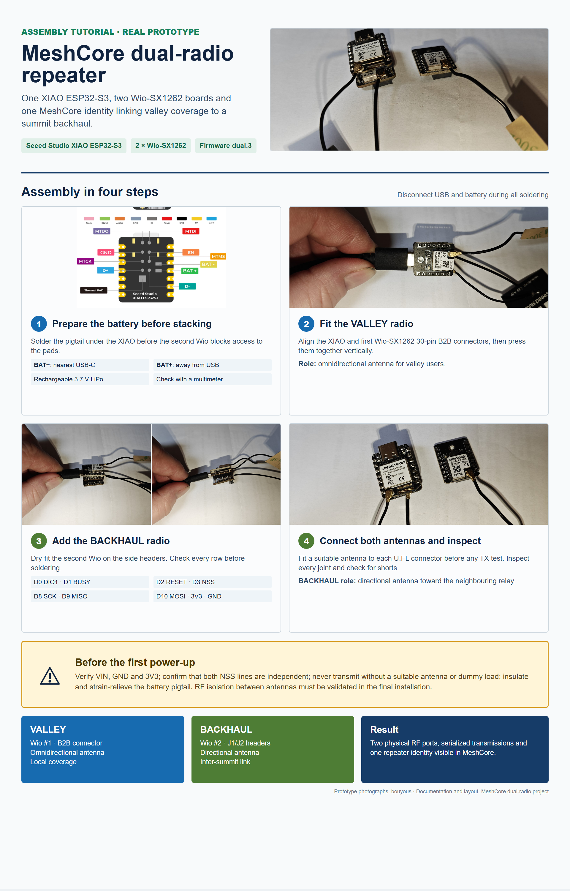
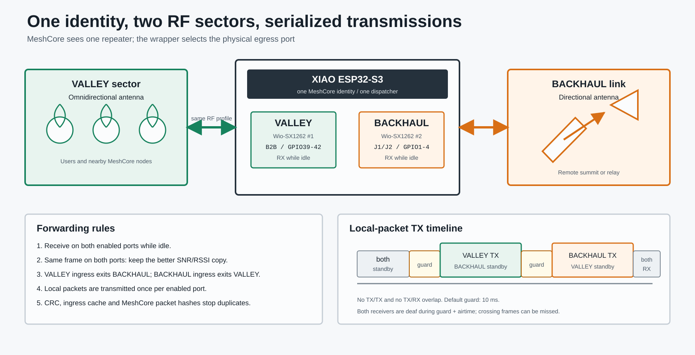

# MeshCore Dual-Radio Repeater for XIAO ESP32-S3

[Version française](README.fr.md) | English documentation below

Experimental MeshCore repeater firmware for one **Seeed Studio XIAO ESP32-S3** driving two **Seeed Studio Wio-SX1262 for XIAO** radio boards.

The node keeps one MeshCore identity and therefore appears as one repeater. The two physical RF ports have distinct jobs:

- `VALLEY`: Wio-SX1262 connected through the standard 30-pin board-to-board connector, intended for an omnidirectional local-coverage antenna.
- `BACKHAUL`: second Wio-SX1262 connected through the XIAO side headers, intended for a directional point-to-point antenna.

This is a bench-tested proof of concept based on MeshCore `repeater-v1.16.0` commit `07a3ca9`. It is not an official MeshCore release.



This is a conceptual illustration of the intended valley and summit deployment. It is not the verified pin-by-pin wiring diagram: use the [wiring tutorial](docs/WIRING.md) before assembling the hardware.

## Why this exists

The original use case is a repeater on a mountain summit. A directional antenna provides the inter-summit backhaul while an omnidirectional antenna serves users in the valley. Both radios use the same MeshCore RF profile, but packets are forwarded from the receiving side to the opposite side.

The work started as a raw RadioLib bridge to validate the wiring. Each Wio-SX1262 was then tested independently in both directions. Once both radios ran reliably on one XIAO, the design was integrated into the official MeshCore repeater firmware.

See [Development history](docs/HISTORY.md) for the full sequence and measured results.

## Hardware

- 1 x [Seeed Studio XIAO ESP32-S3](https://wiki.seeedstudio.com/xiao_esp32s3_getting_started/)
- 2 x [Seeed Studio Wio-SX1262 for XIAO](https://wiki.seeedstudio.com/wio_sx1262_with_xiao_esp32s3_kit/)
- 2 x matched LoRa antennas or dummy loads
- Side headers for the second Wio-SX1262
- Optional qualified rechargeable 3.7 V LiPo and insulated pigtail, soldered to the XIAO underside before stacking

The side-header mapping was checked against Seeed's published schematics and validated on the two physical Wio-SX1262 boards used for this prototype. Hardware revisions can differ, so verify the silkscreen and continuity before soldering another revision.

Full instructions: [Wiring tutorial](docs/WIRING.md).

## Photo assembly tutorial



The [step-by-step assembly guide](docs/ASSEMBLY.md) uses photographs of the actual prototype to show battery preparation, the standard B2B radio, the side-header radio, antenna connections and pre-power checks. A [French version](docs/ASSEMBLY.fr.md) is also available.

## Firmware behavior

- One MeshCore identity and one repeater advertisement.
- Both SX1262 radios listen while the repeater is idle.
- The radios never transmit simultaneously.
- Both receivers enter standby before any transmission.
- Default 10 ms guard time before TX and between sequential transmissions.
- A frame received on `VALLEY` is eligible for retransmission only on `BACKHAUL`, and vice versa.
- Locally generated packets are sent sequentially on both enabled ports.
- Identical frames received simultaneously are coalesced; the port with the better SNR/RSSI becomes the ingress port.
- MeshCore's packet-hash table remains the final duplicate and loop protection layer.
- RF frequency, bandwidth, spreading factor and coding rate remain common to both radios.



Technical details: [Architecture](docs/ARCHITECTURE.md).

## Dual-radio CLI

The commands work in the MeshCore USB console. They use the same `MyMesh::handleCommand()` path as authenticated remote administration, although remote over-the-air operation has not yet been field-tested.

```text
get dualradio
get valley
get backhaul
stats valley
stats backhaul
set valley tx 14
set backhaul tx 22
set valley enabled on
set backhaul enabled on
set dualradio guard 10
clear dualradio.stats
reset dualradio
dualradio help
```

The standard MeshCore command `set tx <dBm>` still sets both radios together. Custom TX values are limited to `-9..22 dBm`. At least one port must remain enabled. Settings are persisted in ESP32 NVS.

Command reference: [Dual-radio CLI](docs/CLI.md).

## Build

Install PlatformIO, then run from the repository root:

```powershell
pio run -e Xiao_S3_WIO_dual_repeater
```

Flash a connected XIAO:

```powershell
pio run -e Xiao_S3_WIO_dual_repeater -t upload --upload-port COM26
```

Replace `COM26` with the port assigned by Windows.

## Prebuilt firmware

Two images are provided in [`firmware/`](firmware/):

- `MeshCore_Xiao_S3_WIO_dual_repeater_v1.16.0-dual.3.bin`: application image for offset `0x10000`.
- `MeshCore_Xiao_S3_WIO_dual_repeater_v1.16.0-dual.3-merged.bin`: complete image for offset `0x0`.

Verify hashes against [`firmware/SHA256SUMS.txt`](firmware/SHA256SUMS.txt).

Example for the merged image:

```powershell
esptool.py --chip esp32s3 --port COM26 write_flash 0x0 firmware/MeshCore_Xiao_S3_WIO_dual_repeater_v1.16.0-dual.3-merged.bin
```

Read [FLASHING.md](docs/FLASHING.md) before using the command, especially when choosing between the merged and application-only images.

After a fresh or merged-image flash, connect through the MeshCore configurator and replace the default administration password (`password`) before deployment. An application-only update normally preserves the existing MeshCore identity and settings, but always verify them after flashing.

## Validation status

Validated on the bench on 10 July 2026:

- both SX1262 radios initialize successfully on one XIAO;
- independent side-header radio TX and RX;
- six of six packets received in each direction during the initial raw-radio tests;
- local MeshCore advertisement produces one `VALLEY` TX followed by one `BACKHAUL` TX;
- per-port enable, power, guard and statistics commands;
- settings survive reboot;
- original MeshCore repeater identity survives firmware updates.

See the exact results and remaining gaps in [TEST_REPORT.md](docs/TEST_REPORT.md).

For maintainers who want to review only the delta from upstream, use [`patches/meshcore-repeater-v1.16.0-dual-sx1262.patch`](patches/meshcore-repeater-v1.16.0-dual-sx1262.patch).

## Important limitations

- This is not a full-duplex repeater. Neither radio receives while either radio transmits.
- Software timing does not provide RF isolation. Antenna spacing, polarization, filtering, enclosure layout and coupled power must be validated at the final site.
- The prototype has not yet completed a long-duration load test or a mountain-to-mountain field trial.
- Over-the-air use of the custom CLI is implemented through the common command path but has only been validated over USB so far.
- The operator is responsible for regional frequency, duty-cycle and EIRP compliance.

Never transmit without a matched antenna or dummy load on both Wio-SX1262 boards.

## Upstream and attribution

This repository is derived from [meshcore-dev/MeshCore](https://github.com/meshcore-dev/MeshCore), licensed under the MIT License. The original README is preserved as [UPSTREAM_README.md](UPSTREAM_README.md).

The prototype was developed as a personal project by GitHub user `bouyous`, in collaboration with OpenAI ChatGPT/Codex. Hardware assembly and physical testing were performed by the project owner; code generation, analysis and documentation were assisted by ChatGPT/Codex. This project is not endorsed by OpenAI, Seeed Studio or the MeshCore maintainers.
