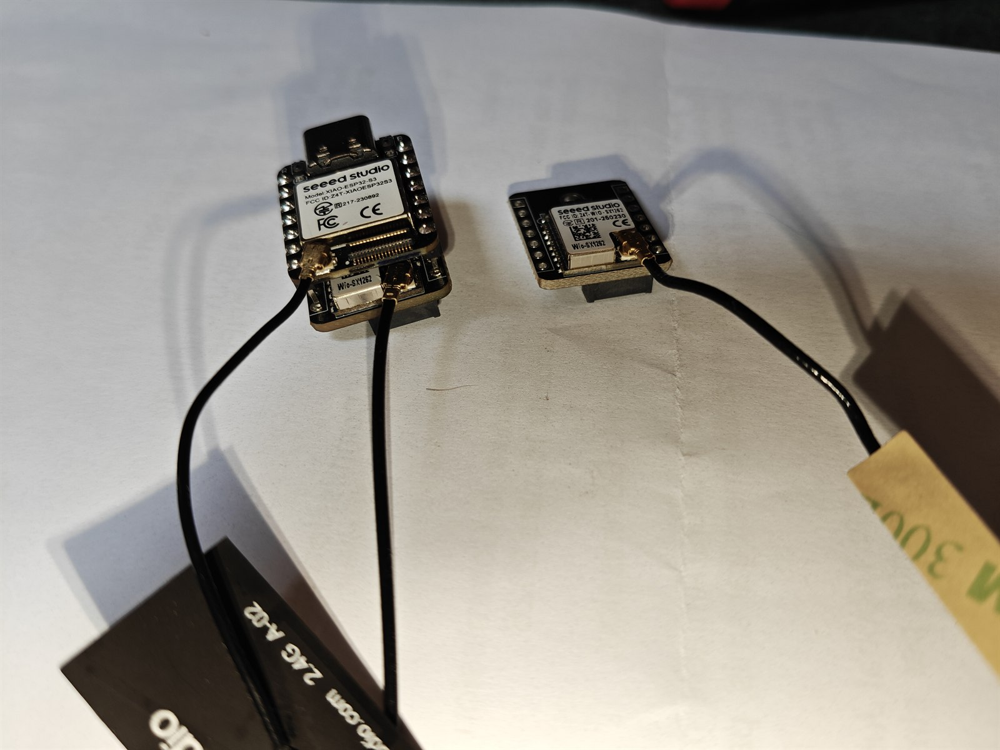
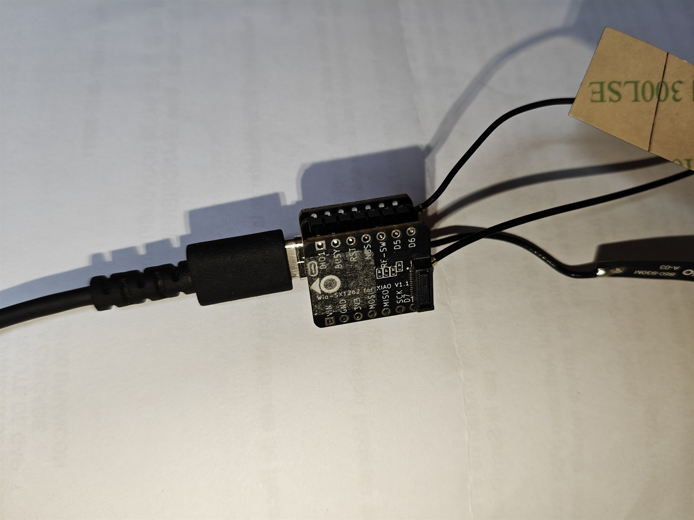
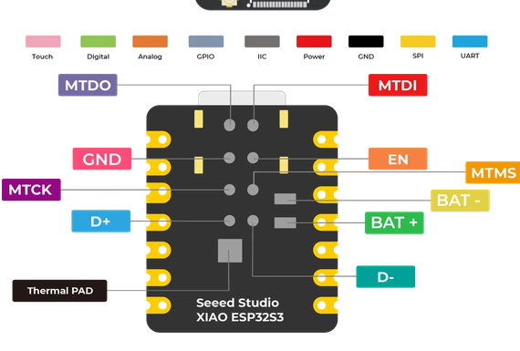
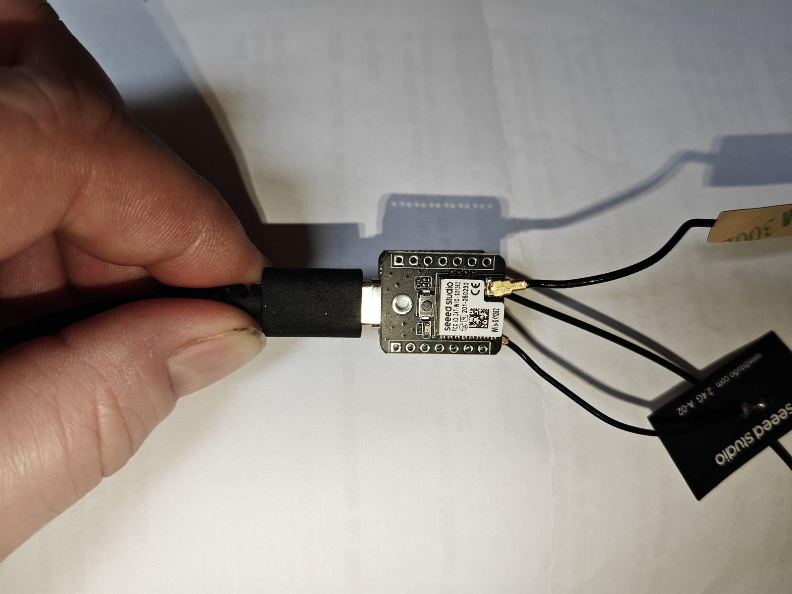
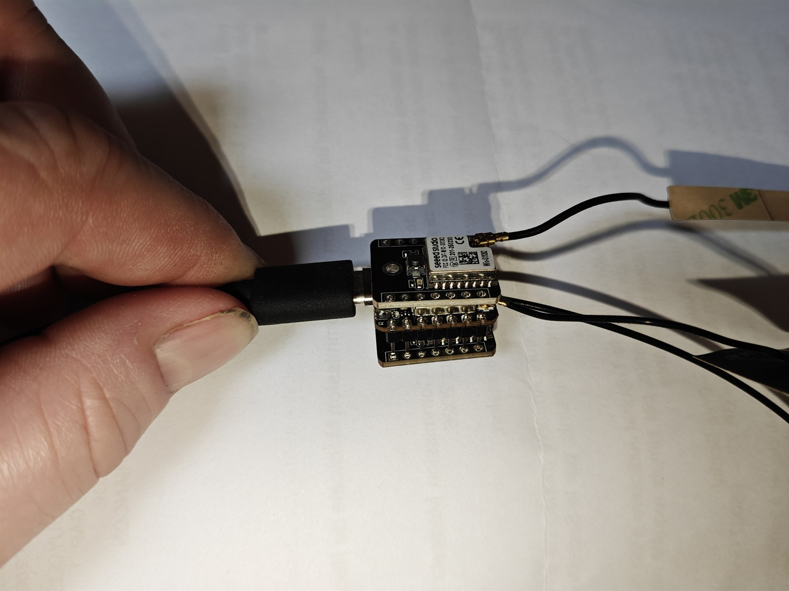
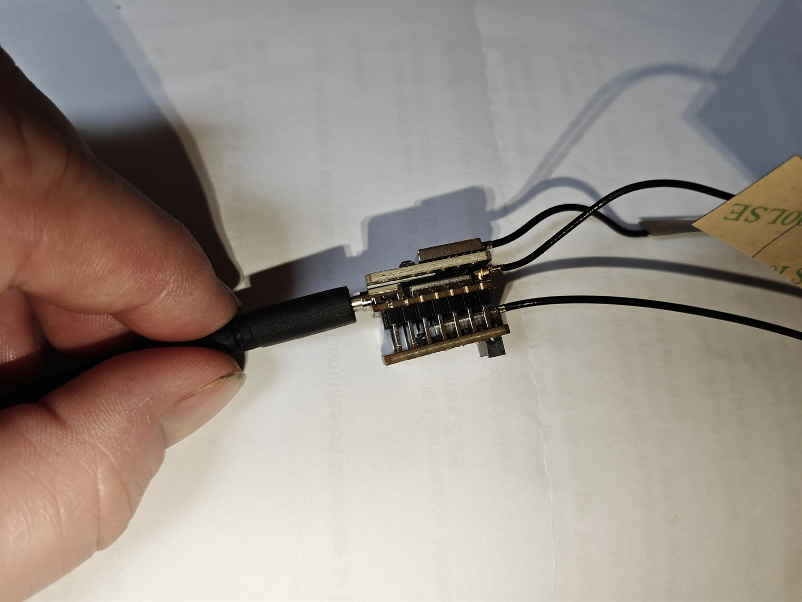
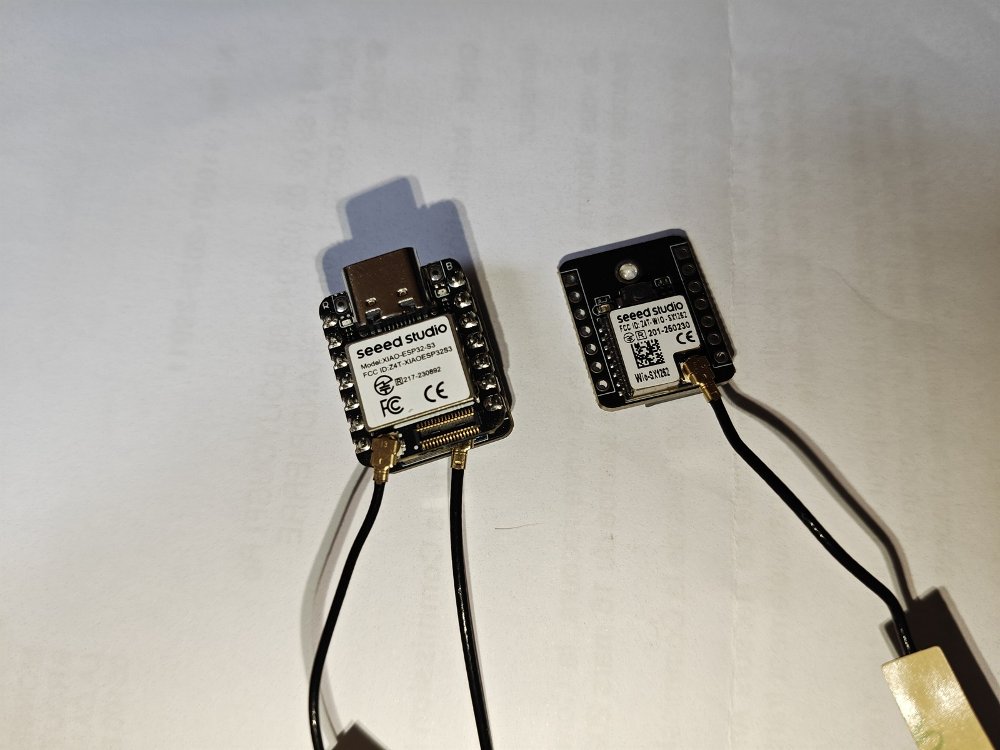

# Tutoriel d'assemblage avec photos réelles

[English version](ASSEMBLY.md)

Ce tutoriel montre le prototype réellement utilisé : un **Seeed Studio XIAO ESP32-S3** et deux **Seeed Studio Wio-SX1262 for XIAO**. La planche ci-dessous résume l'assemblage ; les étapes détaillées suivent.


## Matériel

- 1 × Seeed Studio XIAO ESP32-S3 ;
- 2 × Seeed Studio Wio-SX1262 for XIAO ;
- 2 × antennes LoRa adaptées à la bande utilisée, ou charges fictives pour les essais ;
- deux rangées de broches pour le Wio `BACKHAUL` ;
- un petit faisceau isolé pour une batterie LiPo rechargeable 3,7 V, si elle est prévue ;
- multimètre, fer à souder, flux, loupe et matériel d'isolation.



## Câblage essentiel du `BACKHAUL`

Le second Wio-SX1262 n'utilise pas le connecteur B2B 30 broches. Il se monte sur les deux rangées latérales du XIAO. Vérifier ce raccordement avant de présenter ou de souder la carte.

Le côté `J1` fournit les commandes indépendantes :

| Wio | XIAO | GPIO | Usage |
| --- | --- | ---: | --- |
| DIO1 | D0 | 1 | interruption radio |
| BUSY | D1 | 2 | état occupé |
| RESET | D2 | 3 | remise à zéro |
| NSS / CS | D3 | 4 | sélection SPI du `BACKHAUL` |

Le côté `J2` fournit l'alimentation et le bus SPI partagé :

| Wio | XIAO | GPIO |
| --- | --- | ---: |
| VIN | VIN / 5V | - |
| GND | GND | - |
| 3V3 | 3V3 | - |
| MOSI | D10 | 9 |
| MISO | D9 | 8 |
| SCK | D8 | 7 |



## 1. Tout débrancher

Débrancher le câble USB, la batterie et toute autre alimentation. Ne jamais souder une carte alimentée. Installer une antenne ou une charge adaptée sur chaque Wio avant tout essai d'émission.

## 2. Préparer la batterie avant l'empilage

Les pads sont sous le XIAO et deviendront difficiles à atteindre après la pose du second Wio. Avec l'USB-C comme repère :

- `BAT-` est le pad le plus proche de l'USB-C, à relier au fil noir ;
- `BAT+` est le pad le plus éloigné de l'USB-C, à relier au fil rouge.

Utiliser une batterie lithium rechargeable qualifiée de 3,7 V. Isoler les deux soudures et ajouter un soulagement de traction. Ne pas brancher la batterie sur `VIN`, `5V` ou `3V3`.

### Condensateur réservoir 3,3 V facultatif

Le prototype fonctionne correctement sans condensateur supplémentaire. Pour mieux absorber les transitoires courts d’alimentation, il est possible d’ajouter un condensateur électrolytique faible ESR d’environ `100 à 220 µF`, prévu pour `6,3 V` ou davantage, entre `3V3` et `GND` sur le Wio-SX1262 accessible par les broches latérales. Respecter la polarité : borne positive sur `3V3`, borne négative sur `GND`.

Les broches latérales et le connecteur 30 broches partagent le même rail 3,3 V régulé : ce seul condensateur aide donc le XIAO et les deux radios. Garder ses connexions courtes. Il n’augmente pas la puissance RF et ne remplace pas une batterie ou un régulateur correctement dimensionné ; il réduit seulement les creux très brefs. Débrancher l’USB et la batterie avant toute soudure.



## 3. Monter le Wio `VALLEY`

Le premier Wio-SX1262 utilise le connecteur 30 broches B2B prévu par Seeed. Orienter l'USB-C du XIAO vers le haut, aligner les deux connecteurs et presser verticalement sans torsion. Ce port est destiné à l'antenne omnidirectionnelle de la vallée.



## 4. Présenter le Wio `BACKHAUL`

En suivant le tableau ci-dessus, emboîter à blanc le second Wio sur les broches latérales. Les deux rangées doivent rester parallèles et les cartes ne doivent pas se toucher en dehors des connecteurs prévus. Contrôler encore le côté `J1` des commandes et le côté `J2` alimentation/SPI avant de souder.

## 5. Souder les deux rangées

Immobiliser les cartes parfaitement alignées. Souder d'abord une broche à chaque extrémité, contrôler l'équerrage, puis terminer les autres points. Une soudure doit être brillante, sans boule libre et sans pont entre deux broches.





## 6. Contrôler avant alimentation

Au multimètre :

- vérifier la continuité de `GND`, `3V3`, `MOSI`, `MISO` et `SCK` ;
- vérifier que `GPIO41` (`NSS` du Wio `VALLEY`) n'est pas relié à `GPIO4` (`NSS` du Wio `BACKHAUL`) ;
- confirmer l'absence de court-circuit entre `3V3`, `VIN` et `GND` ;
- contrôler une nouvelle fois la polarité du faisceau batterie.

## 7. Brancher les antennes

Brancher une antenne adaptée sur chaque connecteur U.FL : omnidirectionnelle pour `VALLEY`, directionnelle pour `BACKHAUL`. Les petits coaxiaux ne doivent pas tirer sur les prises. La séparation, la polarisation et l'isolation RF devront être validées dans le boîtier final.



## 8. Flasher et vérifier

Suivre la [procédure de flash](FLASHING.md), puis contrôler au démarrage :

```text
Dual SX1262 repeater mode
VALLEY radio init OK
BACKHAUL radio init OK
```

La commande `get dualradio` doit ensuite afficher les deux ports. Ne commencer les essais TX qu'avec les deux antennes ou charges fictives connectées.

Le tableau électrique complet et les avertissements de montage restent disponibles dans la [notice de câblage](WIRING.md).

## Sources des images

Les photographies du prototype ont été réalisées par `bouyous`. Les diagrammes de brochage proviennent de la documentation officielle Seeed Studio : [XIAO ESP32-S3](https://wiki.seeedstudio.com/xiao_esp32s3_getting_started/) et [kit XIAO ESP32-S3 + Wio-SX1262](https://wiki.seeedstudio.com/wio_sx1262_with_xiao_esp32s3_kit/).
