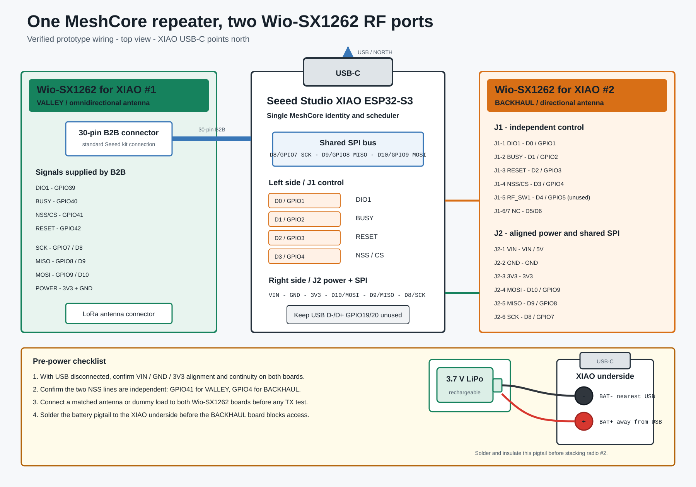

# Wiring tutorial

## Boards used

- Controller: **Seeed Studio XIAO ESP32-S3**.
- Radio 1 / `VALLEY`: **Seeed Studio Wio-SX1262 for XIAO**, connected through the standard 30-pin board-to-board connector.
- Radio 2 / `BACKHAUL`: second **Seeed Studio Wio-SX1262 for XIAO**, connected through its `J1` and `J2` 2.54 mm side headers.



For a photographic walkthrough of the physical assembly, see the [English photo tutorial](ASSEMBLY.md) or the [French version](ASSEMBLY.fr.md).

The diagram uses a top view with the XIAO USB-C connector pointing upward. On the tested assembly, the Wio antenna ends point away from the USB end.

## Shared bus

Both Wio-SX1262 boards share the XIAO SPI bus:

| Signal | XIAO label | ESP32-S3 GPIO |
| --- | --- | ---: |
| SCK | D8 | 7 |
| MISO | D9 | 8 |
| MOSI | D10 | 9 |
| Ground | GND | - |
| Logic supply | 3V3 | - |

NSS, DIO1, BUSY and RESET must not be shared.

## Radio 1: standard 30-pin connector

The official Wio-SX1262 board-to-board connection supplies the first radio signals:

| Signal | ESP32-S3 GPIO |
| --- | ---: |
| DIO1 | 39 |
| BUSY | 40 |
| NSS | 41 |
| RESET | 42 |
| SCK | 7 |
| MISO | 8 |
| MOSI | 9 |

No additional wires are needed for this radio.

## Radio 2: side headers

### Wio `J1` control side

| Wio-SX1262 pin | Signal | XIAO pin | GPIO | Required |
| --- | --- | --- | ---: | --- |
| J1-1 | DIO1 | D0 | 1 | yes |
| J1-2 | BUSY | D1 | 2 | yes |
| J1-3 | RESET | D2 | 3 | yes |
| J1-4 | NSS / CS | D3 | 4 | yes |
| J1-5 | RF_SW1 | D4 | 5 | physically aligned; unused by this firmware |
| J1-6 | NC | D5 | 6 | no function |
| J1-7 | NC | D6 | 43 | no function |

The tested Wio module uses SX1262 DIO2 RF-switch control. GPIO5 is therefore not driven by this firmware.

### Wio `J2` power and SPI side

| Wio-SX1262 pin | Signal | XIAO pin | GPIO | Required |
| --- | --- | --- | ---: | --- |
| J2-1 | VIN | VIN / 5V | - | aligned on tested boards |
| J2-2 | GND | GND | - | yes |
| J2-3 | 3V3 | 3V3 | - | yes |
| J2-4 | MOSI | D10 | 9 | yes |
| J2-5 | MISO | D9 | 8 | yes |
| J2-6 | SCK | D8 | 7 | yes |
| J2-7 | NC | D7 | 44 | no function |

## Before soldering

1. Disconnect USB and all other power.
2. Place the XIAO USB-C connector toward the top.
3. Confirm J2-1/J2-2/J2-3 align with VIN/GND/3V3.
4. Confirm J2-4/J2-5/J2-6 align with D10/D9/D8.
5. Confirm J1-1 through J1-4 align with D0 through D3.
6. Use a multimeter in continuity mode to confirm every shared rail and to confirm the two NSS lines are not shorted.
7. Inspect for solder bridges.
8. Connect a matched antenna or dummy load to both Wio-SX1262 boards.
9. Power the assembly and first test at reduced TX power.

Do not rely on firmware to correct reversed power rails. If the power pins do not align exactly, do not power or solder the stack.

## Firmware pin definitions

The second radio is selected by these build flags:

```ini
-D P_LORA2_DIO_1=1
-D P_LORA2_BUSY=2
-D P_LORA2_RESET=3
-D P_LORA2_NSS=4
```

The shared SPI pins remain those of the official XIAO/Wio MeshCore target.

## Battery pads: solder before stacking

The battery connection is on two pads on the underside of the XIAO ESP32-S3. They will be difficult to reach after the second Wio-SX1262 is soldered across the side headers, so install an insulated battery pigtail first.

With the USB-C connector used as the orientation reference:

| XIAO underside pad | Position | Battery lead |
| --- | --- | --- |
| `BAT-` | closest to USB-C | negative / black |
| `BAT+` | farthest from USB-C | positive / red |

Use a qualified rechargeable 3.7 V lithium battery. The XIAO power-management circuit can charge it from USB-C. Do not connect the cell to `VIN`, `5V` or `3V3`, and never reverse `BAT+` and `BAT-`.

Recommended assembly sequence:

1. Disconnect USB and the battery.
2. Pre-tin the two XIAO battery pads and the pigtail wires.
3. Solder black to the pad nearest USB-C (`BAT-`).
4. Solder red to the pad farthest from USB-C (`BAT+`).
5. Add insulation and strain relief so the wires cannot touch the side headers.
6. Check polarity with a multimeter before connecting the cell.
7. Only then install and solder the second Wio-SX1262.

When the XIAO runs from its battery, Seeed notes that the XIAO `5V` pin has no output. The Wio-SX1262 modules in this assembly use the regulated `3V3` rail.

## Sources used for verification

- [Seeed XIAO ESP32-S3 pin multiplexing](https://wiki.seeedstudio.com/xiao_esp32s3_pin_multiplexing/)
- [Seeed XIAO ESP32-S3 and Wio-SX1262 kit](https://wiki.seeedstudio.com/wio_sx1262_with_xiao_esp32s3_kit/)
- [Seeed Wio-SX1262 for XIAO schematic](https://files.seeedstudio.com/products/SenseCAP/Wio_SX1262/Schematic_Diagram_Wio-SX1262_for_XIAO.pdf)
- [Seeed XIAO ESP32-S3 battery instructions](https://wiki.seeedstudio.com/xiao_esp32s3_getting_started/#battery-usage)

The final mapping was also verified electrically by successful bidirectional packet tests on the actual boards.
